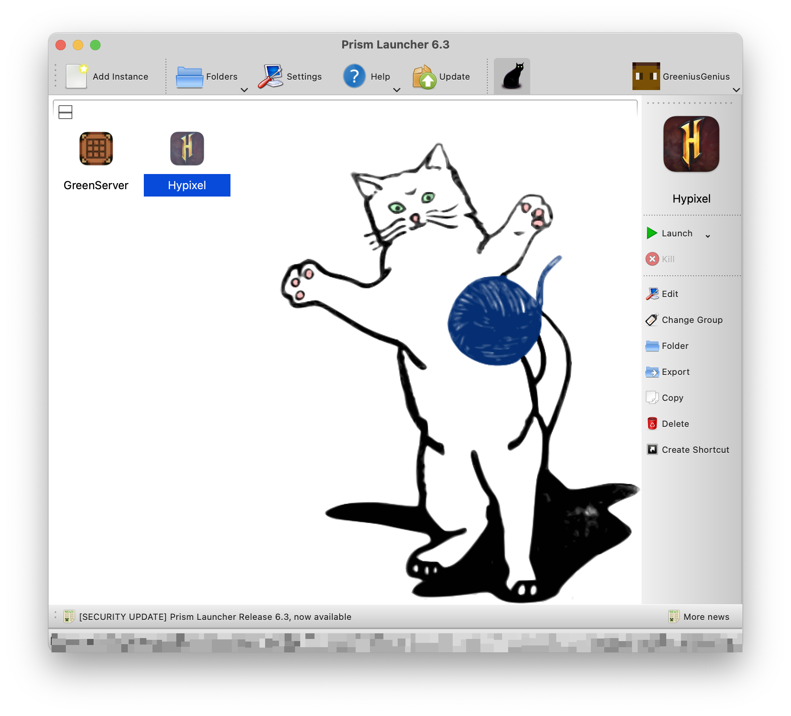

# m1-prism-launcher-hack-1.8.9

Want to get Minecraft running natively on a Mac with an Apple Silicon (M series) chip? Thanks to [the excellent work](https://gist.github.com/tanmayb123/d55b16c493326945385e815453de411a) by [Tanmay Bakshi](https://gist.github.com/tanmayb123), it's possible!

This fork of the original repo, is only intended to be used with Minecraft 1.8.9.

This repo contains a wrapper script to be used with [Prism Launcher](https://prismlauncher.org) that will configure any Prism Launcher instance to use the Apple Silicon native libraries from Tanmay's work. All you have to do is set the wrapper command and make sure you're using an M1-compatible JDK, and it should just work.

## Setup and Usage

### Pre-requisites

First, install the [Zulu Java 8 JRE for macOS ARM64](https://cdn.azul.com/zulu/bin/zulu8.68.0.21-ca-jre8.0.362-macosx_aarch64.dmg).
You'll also need a standard install of Prism Launcher. I'm also using Forge, and various performance and Hypixel QoL mods, but this should work regardless.

### Clone this repo

Open a terminal window.(it's in the `Utilities` folder inside of `Applications`, or you can do Cmd + Space and search for Terminal, and press enter)


I made a directory called `NativeMC` and gave it [This icon from macosicons.com](https://parsefiles.back4app.com/JPaQcFfEEQ1ePBxbf6wvzkPMEqKYHhPYv8boI1Rc/575f4e76ca7ad6d4fb49776b2bea2eb6_OoCOxqkIF9.icns)

The lines beginning with `#` below are comments and don't need to be entered, but it's fine to copy paste them in along with the rest.

```shell
# Make a place to put our wrapper script and libraries
mkdir -p ~/NativeMC

# enter the new directory
cd ~/NativeMC

# clone this repo
git clone https://github.com/GreeniusGenius/m1-prism-launcher-hack-1.8.9.git
```

### Configure Prism Launcher

Create a new Minecraft instance in Prism Launcher (or duplicate an existing one), then click "Edit Instance" in the sidebar.



Go to Settings, then make sure the "Java Installation" checkbox is checked. Then hit "Auto-detect".


It should open a window with a list of Java versions. Find the one that says "zulu-8" in the path and select it, then hit OK. (You may need to resize the window to see the full path.)


Still in the Settings pane, switch to the "Custom Commands" tab. Check the "Custom Commands" checkbox. In the "Wrapper Command" box, enter the full path to the `mcwrap.py` script from this repo, e.g. `/Users/your-username/stuff/m1-multimc-hack/mcwrap.py`. The easiest way to do this, is to navigate to the mcwrap.py file in finder, open the contextual menu (try two finger clicking on a Magic Trackpad, right clicking on a traditional mouse, control clicking on a magic mouse etc.), then while holding Option / Alt ⌥, the copy option will become Copy "/Users/your-username/stuff/m1-multimc-hack/mcwrap.py" as pathname. 

### Mods

Forge works great, I'm using the most recent version ever released for 1.8.9, and the [latest version of optifine for 1.8.9] (https://optifine.net/adloadx?f=preview_OptiFine_1.8.9_HD_U_M6_pre2.jar) as well as various other mods. 


## Support, Licenses etc.

Well if there are any issues, let me know, but there are no guarantees that I can / will fix it.

The files `lwjglfat.jar` and all libraries in the `lwjglnatives` folder were compiled by Tanmay from the source available at https://www.lwjgl.org/source and are subject to its [BSD-style license terms](https://github.com/LWJGL/lwjgl3/blob/master/LICENSE.md).

The original `mcwrap.py` script was written by Yusef Napora, and is public domain. I have forked it to make it play nicely with Prism Launcher and Forge.
